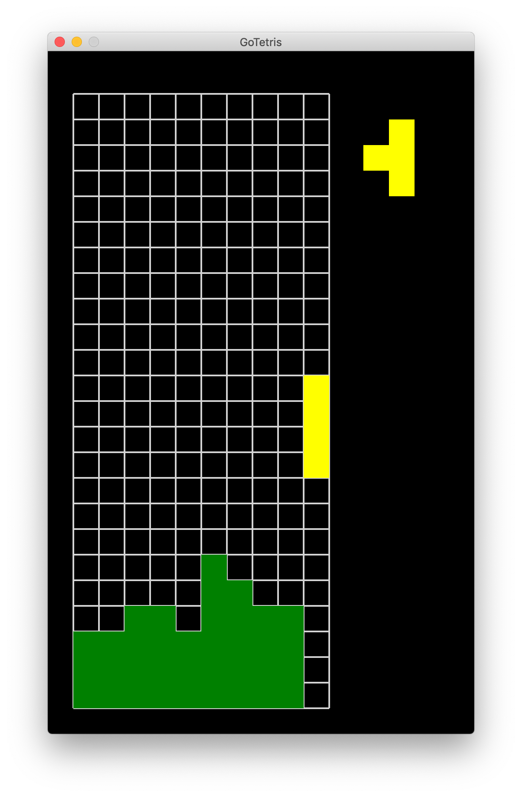

# GoTetris

Bare-bones Tetris implementation written in Go, using [pixel](https://github.com/faiface/pixel) library.

Done:
- Moving pieces
- Rotating pieces
- Falling, collision detection
- Rows clearing, using [Sticky Mode](http://tetris.wikia.com/wiki/Line_clear), implemented via [Flood fill](https://en.wikipedia.org/wiki/Flood_fill) algorithm
- Displaying next piece

Not Done:
- Score calculation
- Proper Game Over/Restart Menu
